**Namn** Jan Haddad
**Datum** 15-09 2026
**Kurs** Introduktion till yrkesrollen och grunderna i IT-infrastruktur

## Introduktion
Iden här labben har jag skapat en virtuell labbmiljö i Vitualbox med en Ubuntu server och en windows 11. Jag ska konfiguera nätverket mellan maskinerna i arbetet med kommandon och behörigheter i både Linux och windwos. Jag har använt Git för versionshantering och AI som hjälp vi felsökning.

## Intord

## Git - Versionshantering och skapa Projektmapp

För att verionshantera mitt arbete använde jag Git bash och Github.

cd ~\dokuments          "för att navigera till dokuments mappen"
mkdir Systementor-Labb  "för att skapa mappen som heter Systementor-Labb"
cd Systementor-Labb     "för att navigera till mappen systementor-Labb"
pwd                     "för att kontrollera att jag är i rätt map (/c/Users/janha/documents/systementor-labb)"  

### initiera Git repository samt skapa dokumentationsfilen

git init                 "För att göra den aktuella mappen till ett git repository"
git branch -M main       "för att döpa den nuvarande branhen till main"

touch Labbdokumentation.md "här skapade vi en markdown fil som heter Labbdokumentation för att kunna dokumetnera senare i uppgiften med hjälp av Visual Studio Code"

git status                    "Som visade att labbdokumentet är ospårade av git "

git add Labbdokumentation.md  ""

### Commits

git log --oneline  "för att kontrollera commit historiken som visade resultat: 

38008c5 Bilder
52215e3 Lagt till bilderna
8d1173e Lägger till bilder och uppdatera dokumentet
64f069e AI användning #2
400602b AI användning #1
e9e1099 Windows 11 katalog
d224640 Behörighetsproblem
a187e4f Behörigheter
4149125 kataloger filer
eeae8de Felsökning
390116e nätverksanslutning
2d237ac nätverkstabell
e0597f2 Konfiguration av win11 och ubunto ip
b478850 Konfiguration av win11 och ubunto ip
f556d38 dokumentation git och github
5368645 grundstruktur
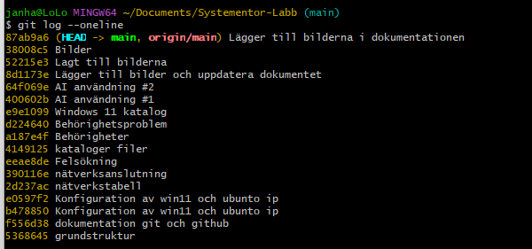
### Github
([Labbmiljö Git CLI och AI](https://github.com/Jan0321/Uppgift_Labbmilj-Git-CLI-och-AI.git))

Jag skapade en repositroy på Github för att kunna lagra projektet externt.

git remote add origin https://github.com/Jan0321/Uppgift_Labbmilj-Git-CLI-och-AI.git "för att koppla mitt lokala git repository till github"

git remote -v        "för att kontrollera att koppligen var ok"

git push -u origin main  "då skickade jag mitt lokala main branch till github"

git status              "då visade det att koppligen lyckades och är synkroiserat med repositoryt på github(On branch main
Your branch is up to date with 'origin/main'.

nothing to commit, working tree clean
)"

## Labbmiljö och nätverk

Jag använder mig utav VirtualBox och har skapat två virtualla maskiner: 

- Windows 11
- Unbunto Server

Jag bröjade med att konfigurera nätverket i båda virtuella maskinerna "VirtualBox-->Settings-->Network." Sedan ändra jag från NAT till Internal Network så att båda maskinerna kan komun lagt till namnen "Labb". Detta gjorde jag på båda maskinerna.

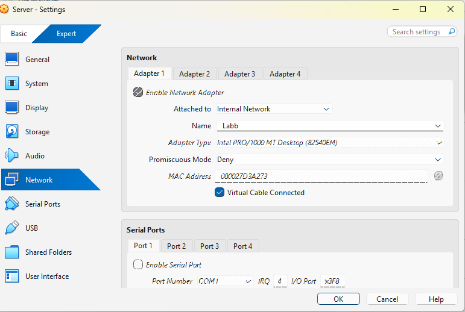

### Ubunto Server

ip addr show        "kontrollerade nätverkskortet. Den heter enp0s3"

nmcli device status  "då fick jag upp att nätverkskortet enp0s3 var frånkopplad (Disconnected)"

sudo nmcli connection add type ethernet ifname enp0s3 con-name Labb ipv4.method manual ipv4.addresses 192.168.10.50/24     "Då skapade jag en ny nätversanslutning som heter Labb och gav servern en statisk IP-adress 192.168.10.50/24"

sudo nmcli connection up Labb   "för att aktiverade jag anslutningen"

ip addr show enp0s3       "då kontrollerade jag den var aktiv (UP) och har fått rätt ip adress 192.168.10.50/24"

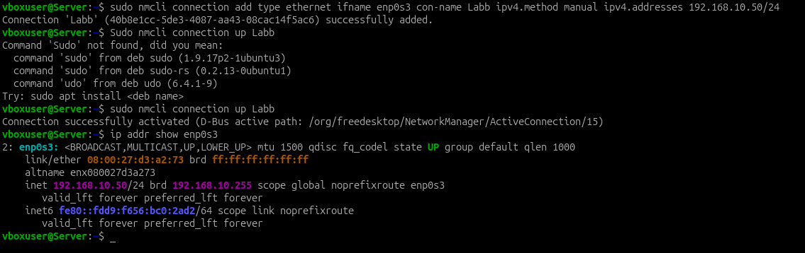

### Windows 11

Använder PowerShell

ipconfig /all    "kontrollerade ip adressen. den hade en automatisk ip-adress"

Network & internet --> Ethernet  Edit på IPv4 adress, Manual IP-adress: 192.168.10.51 Subnet mask: 255.255.255.0
"Jag fick ändra manuellt i windows 11 inställningar till en statisk ip adress 192.168.10.51, subnätmask 255.255.255.0 och ingen gateway på grund av ingen router."
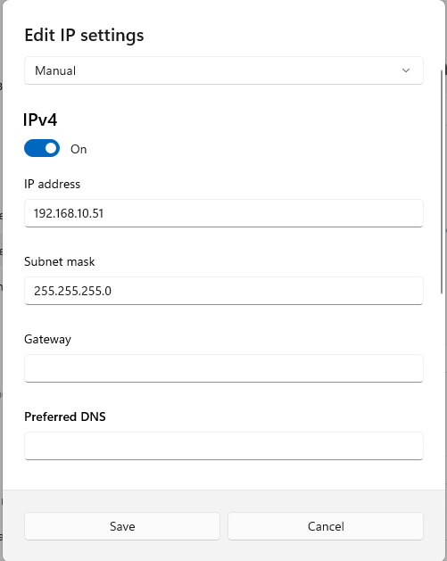

ipconfig /all  "kontrollerade om maskinen fick ip adressen 192.168.10.51 samt att subnätmask 255.255.255.0"

### Nätverkstabell
| Hostname | Operativsystem | IP-adress | Subnätmask | Standard Gateway |
|---|---|---|---|---|
| Server | Ubuntu Server | 192.168.10.50 | 255.255.255.0 (/24) | Ingen |
| Jano | Windows 11 | 192.168.10.51 | 255.255.255.0 (/24) | Ingen |

### Nätvrksanslutning

ping 192.168.10.50  "Testade att pinga från windows 11 till Ubunto server, det gick att pinga lyckades.
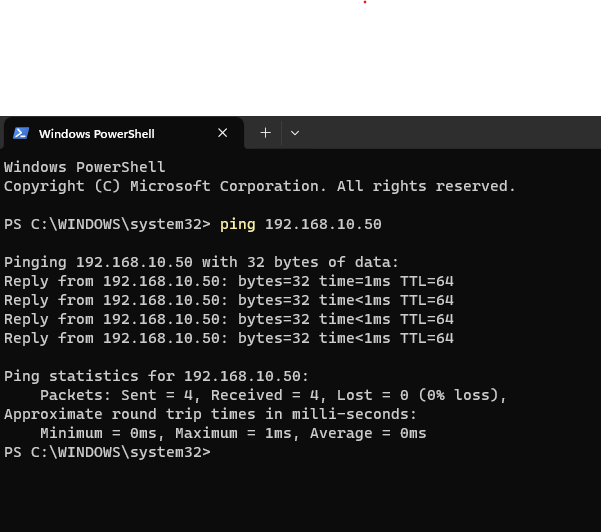

ping 192.168.10.51       "inget hände"
ping -c 4 192.168.10.51  testade att pinga från Ubunto server till windows 11, Det lyckades inte. då skickade jag 4 packet till windows 11 men fick 100% packet loss

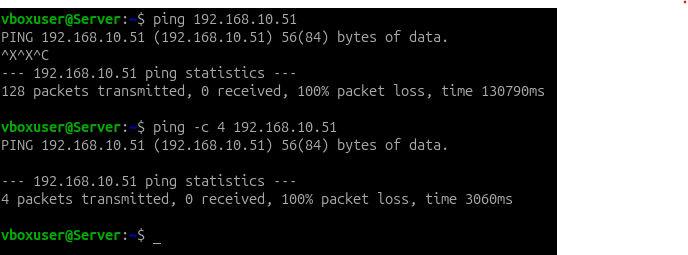

### Felsökning

Eftersom ping fungerade från Windows till ubunto börjar jag felsöka Windows

Get-NetConnectionProfile  "för att kontrollera vilken nätverksprofil windows anväde, och det visade att Ethernet anslutningen använde profilen Public, vilket var relevant när jag felsökte brandväggen.
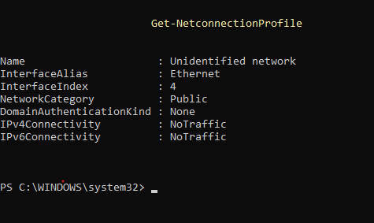

Jag kontrollerade därefter reglerna för inkommande trafik i Windows Defender Firewall. Reglerna för inkommande ICMPv4 Echo Request var inte aktiverade för den aktuella Public-profilen. Det gjorde så att brandväggen blockerade inkommande ping från ubunto servern
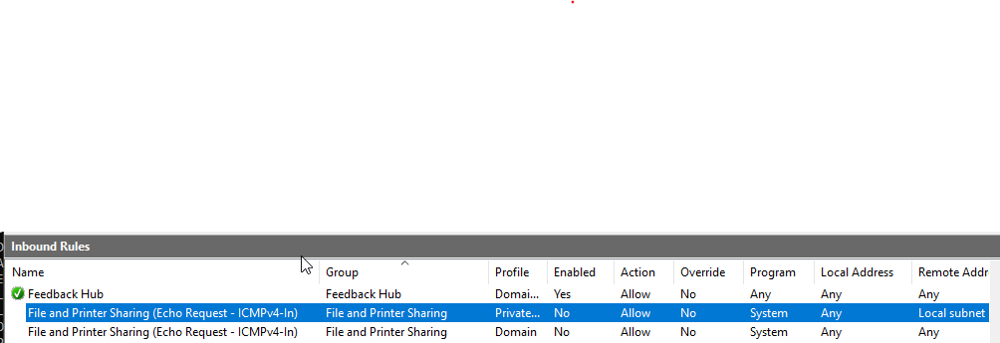

New-NetFirewallRule -DisplayName "Tillat Ping fran Labbnat" -Direction Inbound -Protocol ICMPv4 -IcmpType 8 -Action Allow -Profile Public
här skapade jag en specifik regel för ICMPv4 istället för att stänga av brandväggen. den tillåter inkommande ping förfrågan från ubunto servern.

## Test

ping -c 4 192.168.10.51  "skickade 4packet till windows 11 då fick 0% packet loss det gick att pinga
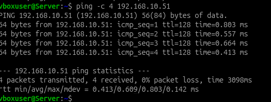

### Katalog & fil

sudo mkdir -p /var/systementor/kosultdata      "för att skapa första katalogen"

ls -ld '/var/systementor/konsultdata           "för att kontrollera katalogen"

sudo touch /var/systementor/konsultdata/anteckningar.txt "skapar filen"

ls -ld '/var/systementor/konsultdata           "för att kontrollera katalogens innehåll"

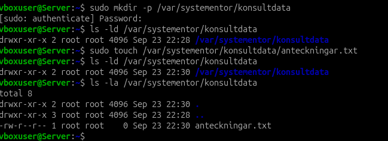

sudo groupadd konsulter         "för att skapa grouppen konsulter"

getent group konsulter                "för att kontrollera grouppen (konsulter:x:1001)"

sudo chgrp -R konsulter /var/systementor/konsultdata "ändrade gruppägaren och innehåll till konsulter"

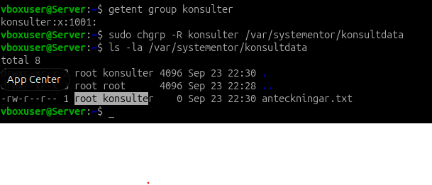

### Behörigheter 

sudo chmod 750 /var/systementor/konsultdata    "behörigheten: admin fullkontroll, gruppen kan läsa och köra och användare har inga behörigheter"

sudo chmod 640 /var/systementor/konsultdata/anteckningar.txt "behörigheter: admin kan läsa och skriva i filen, grouppen kan läsa och användare har inga beöhrigheter"

ls -la /var/systementor/konsultdata  "försökte att kontrollera katalogen men fick Permission denied, på grund av jag var inte medlem i gruppen konsulter"
 
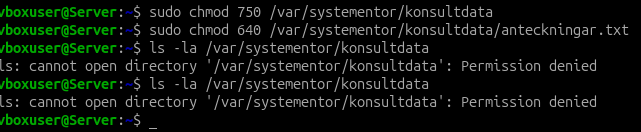

sudo usermod -aG konsulter vboxuser         "lagt till mig själv i grouppen konsulter"

groups vboxuser               "för att kontrollera medlemskapet, då var jag fortforadne obehörig behövde logga ut sedan loga in igen"

groups                        "nu ser jag att jag är med i grouppen konsulter"

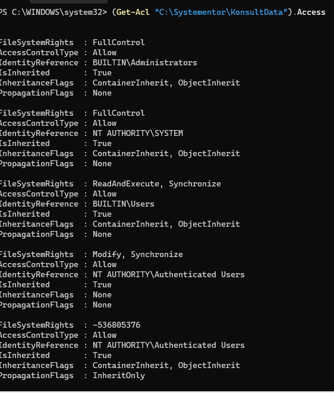

 ### Windows 11 skapa katlog

 New-Item -path  "C:\Systementor\Konsultdata" -ItemType Directory -Force "skapade katalogen"
 Get-Item "C:\Systementor\Konsultdata"  "kontrollerade att katalogen är skapad"

Get-Acl  "C:\Systementor\Konsultdata"         "för att visa vilka behörigheter katalogen hade. Resultated visade att JANO/hadda var ägaren till katalogen" 

(Get-Acl "C:\Systementor\Konsultdata").Access   "för att se behhörigheterna mer detaljerat:
BUILTIN\Administrators        FullControl
NT AUTHORITY\SYSTEM           FullControl
BUILTIN\Users                 ReadAndExecute
NT AUTHORITY\Authenticated Users   Modify
IsInherited : True
Behörigheterna är ärvda från den överordnade katalogen.

Test-Connection 192.168.10.50 -Count 4     "För att testa anslutningen från windows 11 till ubuntu server"

ipconfig /all      "kontrollerade ip-adressen 192.168.10.51 och nätmasken är 255.255.255.0"
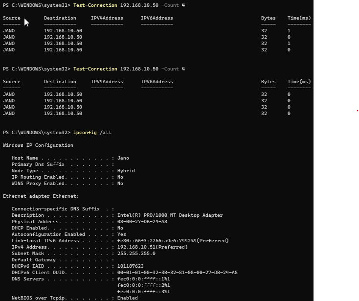

## AI-logg & Utvärdering

### AI-användning

Felsökning av ping mellan ubunto och windows:
under mitt arbete fick jag problem när jag försökte pinga Windows 11 från Unbuntu server. Jag använde chatgpt för att få hjälp med felsökningen.

#### Frågan till AIn:
 Jag frågade Chatgpt är:
 Jag har byggt en virtuell labbmiljö i virtualbox med två virtuella maskiner unbunto server och windows 11. båda maskinerna anvönder samma internal nätverk som heter Labb. Ubuntu server har en statisk ip 192.168.10.50/24 och windows har 192.168.10.51/24. när jag testar anslutningen, windows kan pinga till ubunto utan problem, men när jag pingar från ubuntu till windows så får jag 100% packet loss. Har kontrollerat med ip addr show Ubunto har rätt ip-adress. vad kan felet vara på att komunikationen fungerar inte mellan ubunto till windows?
  
  Svar från AI: 
  Eftersom Windows kan pinga Ubuntu, men Ubuntu inte kan pinga Windows, tyder det på att själva VirtualBox-nätverket och IP-konfigurationen fungerar. Båda maskinerna ligger också i samma subnät 192.168.10.0/24. Ett troligt problem är därför att Windows blockerar inkommande ping-trafik.

Ping använder protokollet ICMP. Windows Defender Firewall kan blockera inkommande ICMP Echo Request, särskilt om ditt interna VirtualBox-nätverk har klassificerats som ett Public-nätverk.

1. Kontrollera nätverksprofilen i Windows

Öppna PowerShell på Windows och kör:

Get-NetConnectionProfile

Titta framför allt efter:

NetworkCategory

Om den visar:

NetworkCategory : Public

använder Windows den mer restriktiva Public-profilen.

2. Kontrollera Windows-brandväggen

Öppna:

wf.msc

Gå till Inbound Rules och leta efter regler som heter ungefär:

File and Printer Sharing (Echo Request - ICMPv4-In)

Kontrollera om en regel som tillåter ICMPv4 är aktiverad för den nätverksprofil som används.

Jag rekommenderar inte att stänga av hela Windows-brandväggen för att lösa problemet. Det är bättre att endast tillåta den trafik som behövs.

3. Tillåt inkommande ping

Om nätverket använder Public kan du öppna PowerShell som administratör och skapa en specifik regel:

New-NetFirewallRule -DisplayName "Tillat Ping fran Labb" -Direction Inbound -Protocol ICMPv4 -IcmpType 8 -Action Allow -Profile Public

Detta tillåter inkommande ICMPv4 Echo Request på Public-profilen utan att stänga av hela brandväggen.

4. Testa igen från Ubuntu

Kör:

ping -c 4 192.168.10.51

Om problemet var Windows-brandväggen bör du nu få svar, exempelvis:

64 bytes from 192.168.10.51: icmp_seq=1 ...
64 bytes from 192.168.10.51: icmp_seq=2 ...

och i slutet:

4 packets transmitted, 4 received, 0% packet loss

Om det fortfarande blir 100% packet loss bör nästa steg vara att kontrollera Windows IP-konfiguration med ipconfig /all och verifiera att 192.168.10.51 verkligen sitter på rätt VirtualBox-nätverkskort.

Det viktiga är alltså att testa hypotesen i stället för att direkt anta att brandväggen är orsaken. Om ping börjar fungera efter den specifika brandväggsändringen har du starkt stöd för att den inkommande ICMP-trafiken var det som blockerades.

#### Utvädering: 
Jag tyckte svaret på ai var tydlig och hjälpte mig att hitta problemet, hittade inga tydliga hallucinationer i svaret AIN gav. AI föreslog att jag skulle kontrollera brandväggen i windows efterson windows kunde pinga Ubuntu. Efter jag kontrollerade nätverksprofilen med "Get-NetConnectionProfile" då såg jag att nätverket använde profile Public. Efter jag kontrollerade brandbäggen skapade jag regeln för ICMPv4 som Ai föreslog.
Efter det så testade jag pinga igen med "ping -c 4 192.168.10.51" den här gången fick jag 0% packet loss och 4 packet recived. Då fungerade lösningen.
Lösningen var bra efter som jag behövde inte stänga av hela brandbäggen, Samt lärde jag mig att man ska inte lita direkt på AIn svar, utan testa och kontrollera att lösningen fungerar.

#### Fråga till AIn:

Jag skapade katalogen /var/systementor/konsulter på ubunto server. katalogen ägs av root och gruppen konsulter, jag satte behörigheten 750 på katalogen och 640 på filen anteckningar.txt. när kag kör ls -la /var/systementor/konsultdata får jag permission denied. mitt användar namn är vboxuser. varför får jag detta fel meddelandet och hur kan jag lösa det?

AIn svarade: 

Felet beror troligtvis på att vboxuser inte har rätt behörighet till katalogen.

Katalogen ägs av:

root konsulter

och har behörigheten 750. Det betyder:

7 = ägaren (root) får läsa, skriva och köra
5 = gruppen (konsulter) får läsa och köra
0 = övriga användare får ingen åtkomst

Om vboxuser inte är medlem i gruppen konsulter får användaren alltså ingen åtkomst och därför visas Permission denied.

Jag skulle först kontrollera vilka grupper användaren tillhör:

groups vboxuser

Om konsulter inte finns med kan användaren läggas till i gruppen:

sudo usermod -aG konsulter vboxuser

Sedan kan man kontrollera igen:

groups vboxuser

Efter att användaren har lagts till i gruppen kan man behöva logga ut och logga in igen för att gruppmedlemskapet ska börja gälla.

Efter ny inloggning kan man testa:

ls -la /var/systementor/konsultdata

Om vboxuser nu är medlem i gruppen konsulter bör katalogen gå att läsa.

Det är bättre att lägga användaren i rätt grupp än att exempelvis ändra behörigheten till 777, eftersom 777 skulle ge alla användare onödigt stora behörigheter. På detta sätt behåller man principen om minsta möjliga behörighet.

#### Utvädering: 
AIs svar var tydlig och hjälpte mig att förestå varför jag fick fel meddelandet. AI förklarade att det var vboxuser som inte hade tillgång till katalogen eftersom användaren inte var medlem i grouppen konsutlter. 
Jag följde AIs instruktioner och lag till vboxuser i gruppen konsulter med "sudo usermod -aG konsulter vboxuser" efter jag loggade ut och in igen så kontrollerade jag igen med "groups" så fungerade det och vboxuser är medlem i gruppen konsulter. sedan körde jag "ls -la /var/systementor/konsultdata" igen och kunde komma åt katalogen. 
Jag hittade inga hallucinationer eller säkerhetsproblem med AIs svar för att jag verifierade lösningen genom att kontrollera gruppen med groups ls -la igen. Jag tyckte att lösningen var ganska bra eftersom jag kunde behålla behörigherna 750 coh 640 istället för att ge alla användare mer behörighet.